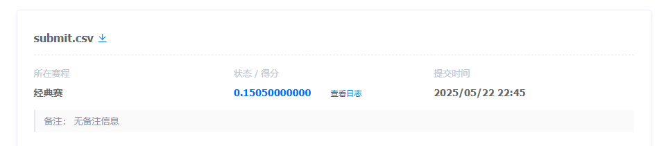

# 基于Baseline的Few-shot CoT优化

## 一、实验背景

本实验聚焦于小学数学题自动求解任务，目标是基于baseline方案，通过引入Few-shot Chain-of-Thought（CoT）推理模式，提升大语言模型（Qwen2.5-0.5B-Instruct）的解题准确率。

---

## 二、Baseline方案简述

- **模型**：Qwen2.5-0.5B-Instruct
- **推理方式**：Zero-shot（仅用题目和指令，无推理示例）
- **答案提取**：直接从模型输出中提取数字
- **分数**：0.1385

Baseline方案下，模型经常只输出答案，导致准确率受限。

---

## 三、探索过程与失败尝试

在找到最优方案前，我们进行了多次尝试，下面是主要的尝试与教训：

### 1. 纯Zero-shot尝试

最初我们只是简单地将问题输入模型，不加任何额外指导：

```
{"role": "user", "content": f"{input_value}"}
```

**结果**：模型只输出最终答案，没有任何解题过程。

- **问题**：没有解题步骤，模型直接猜测答案，准确率较低。

### 2. 带指令的Zero-shot尝试

我们添加了简单指令，要求模型给出解题过程：

```
{"role": "user", "content": f"{input_value} 请给出解题过程和答案。"}
```

**结果**：模型开始输出一些解题步骤，但步骤不够详细，推理链经常断裂。

- **问题**：推理深度不足，复杂题目的解题逻辑不完整。

### 3. 简单Few-shot尝试（无CoT）

添加了示例，但示例中只有问题和答案，没有详细的推理过程：

```
{"role": "user", "content": "计算 5 + 3 × 2"},
{"role": "assistant", "content": "答案是11。"},
```

**结果**：模型学会了输出格式，但没有学到解题思路，常跳过中间步骤。

- **问题**：模型只学习了输出格式，没有学习推理过程。

### 4. 错误答案提取逻辑

我们最初使用了简单的答案提取逻辑，直接提取文本开头的数字或全文任意数字：

```python
def extract_answer(response):
    # 尝试提取开头的数字
    match = re.match(r"^\s*(\d+\.?\d*)", response)
    if match:
        return match.group(1)
    return ""
```

**结果**：经常提取到中间计算步骤的数字，而非最终答案。

- **问题**：答案准确率大幅下降，导致整体分数降低。

---

## 四、Few-shot CoT方案设计

### 1. Few-shot CoT原理

Few-shot CoT（Chain-of-Thought）即在prompt中加入带有详细推理步骤的示例，显式引导模型模仿推理链，提升其多步推理和复杂题目的解答能力。

### 2. 具体实现

- 在每个问题前，插入2个带有详细推理过程和答案的示例（如"计算 5 + 3 × 2"、"小明有10个苹果，吃了4个，还剩几个？"等），让模型学习如何分步推理并输出最终答案。

```python
messages = [
    {"role": "system", "content": f"{instruction}"},
    # Few-shot example 1
    {"role": "user", "content": "计算 5 + 3 × 2"},
    {"role": "assistant", "content": "详细思考过程：\n1. 根据数学运算顺序，先计算乘法。\n2. 3 × 2 = 6。\n3. 然后计算加法。\n4. 5 + 6 = 11。\n最终答案：<answer>11</answer>"},
    # Few-shot example 2
    {"role": "user", "content": "小明有 10 个苹果，吃了 4 个，还剩几个？"},
    {"role": "assistant", "content": "详细思考过程：\n1. 小明原来有 10 个苹果。\n2. 他吃了 4 个。\n3. 剩下的苹果数量是原来的减去吃的。\n4. 10 - 4 = 6。\n最终答案：<answer>6</answer>"},
    # The actual problem
    {"role": "user", "content": f"{input_value} 请针对每一道题目，都一步一步地详细思考，并给出完整的解答过程和最终答案。"}
]
```

- 优化答案提取逻辑，使用多重保险机制：

```python
def extract_answer(response):
    # 1. 尝试查找特定的结束语后的数字
    specific_phrase_match = re.search(r"(?:最终答案|最终结果|答案是|结果是)[:：\s]*(-?\d+\.?\d*)", response)
    if specific_phrase_match:
        return specific_phrase_match.group(1).strip()

    # 2. 如果未找到，尝试提取文本中最后出现的数字
    last_number_match = re.search(r"(-?\d+\.?\d*)[^0-9.-]*$", response)
    if last_number_match:
        return last_number_match.group(1).strip()

    # 3. Fallback: 如果以上都找不到，返回空字符串
    return ""
```

---

## 五、实验结果


