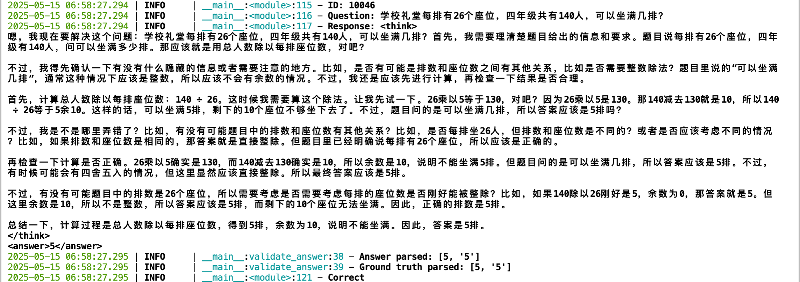

# GRPO Report

## Shared Setup
- **Pretrained Model:** `Qwen3-0.6B(Instruct)`
- **Training Framework:** `Huggingface` + `Trl` + `Accelerate`
- **Training Method:** `LoRA`
- **Training Set Size:** `10000`

## Baseline performance
- **Validation Set Accuracy:** 
    - `val_2k.json`
        - "You are a helpful Math assistant. Carefully think step by step and enclose your response within <think> </think> and <answer> </answer> tags, respectively, i.e., <think> reasoning process here </think><answer> answer here </answer>": `73.39%`
    - `val_300.json`
        - "You are a helpful Math assistant. Carefully think step by step and enclose your response within <think> </think> and <answer> </answer> tags, respectively, i.e., <think> reasoning process here </think><answer> answer here </answer>": `74.33%`
        - "这是小学数学1-6年级的校内题目，无需进行分析，请直接输出数字答案，不带单位。": `74.67%`
        - "You are a helpful Math assistant. 这是小学数学1-6年级的校内题目，请直接输出数字答案，不带单位。": `75.00%`

## Problems
- The task of solving math problems is extremely sensitive to the randomness of model generation, as the model may take different inference paths, leading to different results and, importantly, high variation in accuracy on validation sets.
- To address this, one effective way is greedy search (or nearly greedy search), i.e., set `temperature` to `0`.

## Ablation Experiments

### Raw_r32P_Latex

#### Setup
- `train_dataset`: `raw_10k.json`
- `max_lora_rank`: `32`
- `learning_rate`: `5e-5`
- `batch_size`: `28`
- `num_generations`: `7`
- `max_grad_norm`: `0.1`
- `reward_funcs`: `format_reward`, `tag_count_reward`, `accuracy_reward`, `cosine_scaled_reward`
- `system_prompt`: "You are a helpful math assistant. When the user ask a question, the assistant first thinks about the reasoning process in the mind and then provides the user with the answer. The reasoning process and answer are enclosed within <think> </think> and <answer> </answer> tags, respectively, i.e.,\n<think>\nreasoning process here\n</think>\n<answer> answer here wrapped in \\boxed{} </answer>"

#### Results
- Rewards increased with global steps, but the model's performance was not satisfactory. Accuracy reward fluctuated around 0.15, which we guess is due to the failure of the accuracy reward function to extract the correct answer from the model's completion.
    

- Tested on the validation set, the finetuned model failed to generate response following the format required by the system prompt. The answer between <answer> </answer> tags was not wrapped in `\\boxed{}`.
    
    

### Raw_r32_Plain_ng7

#### Setup
- `train_dataset`: `raw_10k.json`
- `max_lora_rank`: `32`
- `learning_rate`: `5e-5`
- `batch_size`: `28`
- `num_generations`: `7`
- `max_grad_norm`: `0.1`
- `reward_funcs`: `format_reward`, `tag_count_reward`, `accuracy_reward`, `cosine_scaled_reward`
- `system_prompt`: "You are a helpful Math assistant. Carefully think step by step and enclose your response within <think> </think> and <answer> </answer> tags, respectively, i.e., <think> reasoning process here </think><answer> answer here </answer>"
- *Extra modification*: refactor the logic of answer extraction which focuses on the response between <answer> </answer> tags.

#### Results
- Rewards increased slowly as expected. Accuracy reward improved significantly, fluctuating around 0.7
    
    
- On the validation set, the finetuned model generated response following the format required by the system prompt.
    
- `val_300.json` accuracy: `72.67%`

### Raw_r32_Plain_ng6_bs24

#### Setup
- `train_dataset`: `raw_10k.json`
- `max_lora_rank`: `32`
- `learning_rate`: `5e-5`
- `batch_size`: `24`
- `num_generations`: `6`
- `max_grad_norm`: `0.1`
- `reward_funcs`: `format_reward`, `tag_count_reward`, `accuracy_reward`, `cosine_scaled_reward`
- `system_prompt`: "You are a helpful Math assistant. Carefully think step by step and enclose your response within <think> </think> and <answer> </answer> tags, respectively, i.e., <think> reasoning process here </think><answer> answer here </answer>"

#### Results
- Slight difference in the reward function, while `num_generations=6, batch_size=24` is even a little bit better than `num_generations=7, batch_size=28`.
    
- `val_300.json` accuracy: `71.67%`

### Raw_r32_Plain_Len_Reward
#### Setup
- `train_dataset`: `raw_10k.json`
- `max_lora_rank`: `32`
- `learning_rate`: `5e-5`
- `batch_size`: `24`
- `num_generations`: `6`
- `max_grad_norm`: `0.1`
- `reward_funcs`: `format_reward`, `tag_count_reward`, `accuracy_reward`, `cosine_scaled_reward`, `length_reward`
- `system_prompt`: "You are a helpful Math assistant. Carefully think step by step and enclose your response within <think> </think> and <answer> </answer> tags, respectively, i.e., <think> reasoning process here </think><answer> answer here </answer>"
- *Extra modification*: add length reward function provided by the Kimi 1.5 tech report, to discourage overthinking and promote token efficiency.

#### Results
- Total reward seems a little better than the previous one.
    
- `val_300.json` accuracy: `75.67%`

### Raw_r16_Len_Reward
#### Setup
- `train_dataset`: `raw_10k.json`
- `max_lora_rank`: `16`
- `learning_rate`: `5e-5`
- `batch_size`: `24`
- `num_generations`: `6`
- `max_grad_norm`: `0.1`
- `reward_funcs`: `format_reward`, `tag_count_reward`, `accuracy_reward`, `cosine_scaled_reward`, `length_reward`
- `system_prompt`: "You are a helpful Math assistant. Carefully think step by step and enclose your response within <think> </think> and <answer> </answer> tags, respectively, i.e., <think> reasoning process here </think><answer> answer here </answer>"

#### Results
- Significant improvement is seen in all reward functions.
    
- `val_300.json` accuracy: `72.33%`

### Raw_r16
#### Setup
- `learning_rate`: `5e-5`
- `batch_size`: `24`
- `num_generations`: `6`
- `max_grad_norm`: `0.1`
- `reward_funcs`: `format_reward`, `tag_count_reward`, `accuracy_reward`, `cosine_scaled_reward`
- `system_prompt`: "You are a helpful Math assistant. Carefully think step by step and enclose your response within <think> </think> and <answer> </answer> tags, respectively, i.e., <think> reasoning process here </think><answer> answer here </answer>"

#### Results
- `val_300.json` accuracy: `71.00%`

### Raw_r8
#### Setup
- `train_dataset`: `raw_10k.json`
- `max_lora_rank`: `8`
- `learning_rate`: `5e-5`
- `batch_size`: `24`
- `num_generations`: `6`
- `max_grad_norm`: `0.1`
- `reward_funcs`: `format_reward`, `tag_count_reward`, `accuracy_reward`, `cosine_scaled_reward`, `length_reward`
- `system_prompt`: "You are a helpful Math assistant. Carefully think step by step and enclose your response within <think> </think> and <answer> </answer> tags, respectively, i.e., <think> reasoning process here </think><answer> answer here </answer>"

#### Results
- Training rewards resemble those of `max_lora_rank=16`.
    
- `val_300.json` accuracy: `71.67%`

### Raw_r16_official_sampling
#### Setup
- `train_dataset`: `raw_10k.json`
- `max_lora_rank`: `8`
- `learning_rate`: `5e-5`
- `batch_size`: `24`
- `num_generations`: `6`
- `max_grad_norm`: `0.1`
- `reward_funcs`: `format_reward`, `tag_count_reward`, `accuracy_reward`, `cosine_scaled_reward`, `length_reward`
- `system_prompt`: "You are a helpful Math assistant. Carefully think step by step and enclose your response within <think> </think> and <answer> </answer> tags, respectively, i.e., <think> reasoning process here </think><answer> answer here </answer>"
- *Extra modification*: use official sampling parameters during training.
    - `temperature`: `0.9`
    - `top_p`: `0.95`
    - `top_k`: `20`
    - `min_p`: `0`

#### Results
- Training rewards showed no significant difference.
    
- `val_300.json` accuracy: `69.67%`

### Raw_r16_cosine_modified
#### Setup
- `train_dataset`: `raw_10k.json`
- `max_lora_rank`: `8`
- `learning_rate`: `5e-5`
- `batch_size`: `24`
- `num_generations`: `6`
- `max_grad_norm`: `0.1`
- `reward_funcs`: `format_reward`, `tag_count_reward`, `accuracy_reward`, `cosine_scaled_reward`, `length_reward`
- `system_prompt`: "You are a helpful Math assistant. Carefully think step by step and enclose your response within <think> </think> and <answer> </answer> tags, respectively, i.e., <think> reasoning process here </think><answer> answer here </answer>"
- *Extra modification*: modify the hyperparameters of cosine reward function
    - `cosine_max_len`: `1000`
    - `cosine_min_value_wrong`: `-10.0`
    - `cosine_max_value_wrong`: `0`
    - `cosine_min_value_correct`: `1.0`
    - `cosine_max_value_correct`: `2.0`

#### Results
- Performance at response format dropped a little bit.
    
- `val_300.json` accuracy: `70.00%`

### Raw_r32_repetition_penalty
#### Setup
- `train_dataset`: `raw_10k.json`
- `max_lora_rank`: `32`
- `learning_rate`: `5e-5`
- `batch_size`: `24`
- `num_generations`: `6`
- `max_grad_norm`: `0.1`
- `reward_funcs`: `format_reward`, `tag_count_reward`, `accuracy_reward`, `cosine_scaled_reward`, `length_reward`, `repetition_penalty_reward`
- `system_prompt`: "You are a helpful Math assistant. Carefully think step by step and enclose your response within <think> </think> and <answer> </answer> tags, respectively, i.e., <think> reasoning process here </think><answer> answer here </answer>"
- *Extra modification*: add repetition penalty reward function to penalize the model for generating repeated tokens.
    - `ngram_size`: `40`
    - `max_penalty`: `-0.05`

#### Results
- Better training rewards than that without repetition penalty
    
- `val_300.json` accuracy: `65.33%`

### Raw_r32_new_prompt
#### Setup
- `train_dataset`: `raw_10k.json`
- `max_lora_rank`: `32`
- `learning_rate`: `5e-5`
- `batch_size`: `24`
- `num_generations`: `6`
- `max_grad_norm`: `0.1`
- `reward_funcs`: `accuracy_reward`, `cosine_scaled_reward`, `length_reward`
- `system_prompt`: "You are a helpful Math assistant. 这是小学数学1-6年级的校内题目，请直接输出数字答案，不带单位。"

#### Results
- No big difference in training rewards.
    
- `val_300.json` accuracy: `68.33%`

## Ablation Experiments Summary

| Experiment Name             | max_lora_rank   | batch_size   | num_generations   | reward_funcs                                                                 | val_300.json Accuracy   |
| :-------------------------- | :-------------- | :----------- | :---------------- | :--------------------------------------------------------------------------- | :---------------------- |
| Baseline         | N/A             | N/A          | N/A               | N/A                                                                          | `74.33%`                |
| Raw_r32_ng7           | `32`            | `28`         | `7`               | `format_reward`, `tag_count_reward`, `accuracy_reward`, `cosine_scaled_reward` | `72.67%`                |
| Raw_r32_ng6_bs24      | `32`            | `24`         | `6`               | `format_reward`, `tag_count_reward`, `accuracy_reward`, `cosine_scaled_reward` | `71.67%`                |
| Raw_r32_Len_Reward    | `32`            | `24`         | `6`               | `format_reward`, `tag_count_reward`, `accuracy_reward`, `cosine_scaled_reward`, `length_reward` | `75.67%`                |
| Raw_r16_Len_Reward    | `16`            | `24`         | `6`               | `format_reward`, `tag_count_reward`, `accuracy_reward`, `cosine_scaled_reward`, `length_reward` | `72.33%`                |
| Raw_r16               | `16`        | `24`         | `6`               | `format_reward`, `tag_count_reward`, `accuracy_reward`, `cosine_scaled_reward` | `71.00%`                |
| Raw_r8                | `8`             | `24`         | `6`               | `format_reward`, `tag_count_reward`, `accuracy_reward`, `cosine_scaled_reward`, `length_reward` | `71.67%`                |
| Raw_r16_cosine_modified | `8`           | `24`         | `6`               | `format_reward`, `tag_count_reward`, `accuracy_reward`, `cosine_scaled_reward`, `length_reward` | `70.00%`                |
| Raw_r32_repetition_penalty | `32`       | `24`         | `6`               | `format_reward`, `tag_count_reward`, `accuracy_reward`, `cosine_scaled_reward`, `length_reward`, `repetition_penalty_reward` | `65.33%`                |

## Conclusion
GRPO总体的效果并不好，答题准确率相对baseline几乎都有所下降，推测原因是：
- Deepseek使用GRPO微调主要是为了模型按照特定格式输出答案(think和answer标签)，而Qwen3模型本身已经会推理(think标签)并输出答案(不带标签)，因此GRPO微调的必要性不大。
- GRPO微调的奖励函数设计可能不够完善，目前的奖励函数主要是针对格式和标签的正确性，以及最终答案的正确性，但没有考虑到模型推理过程的完整性和逻辑性。