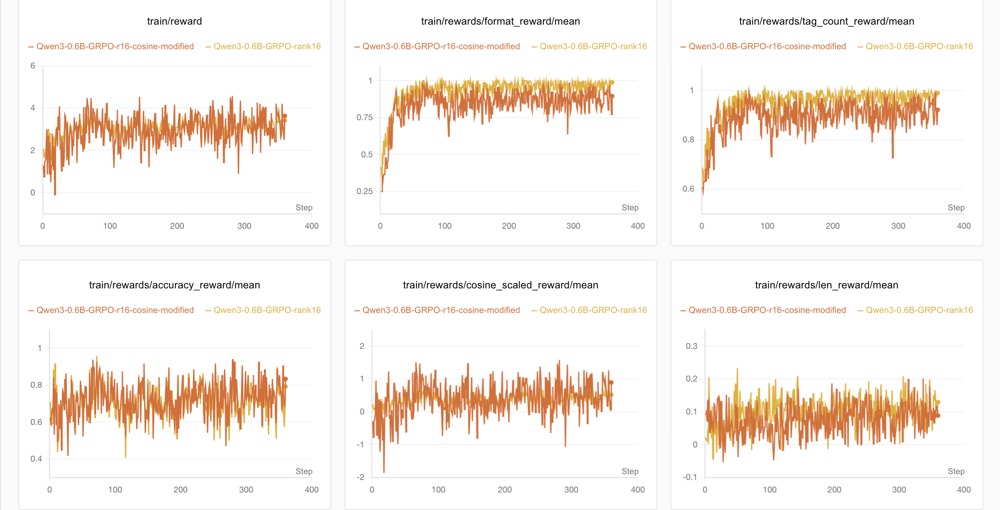
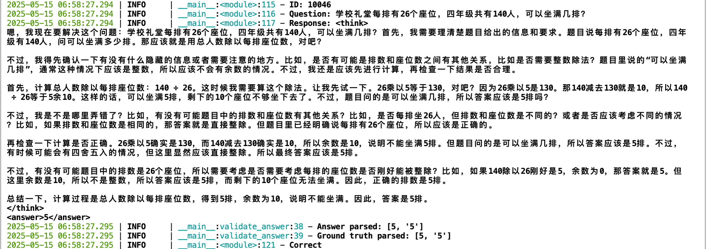
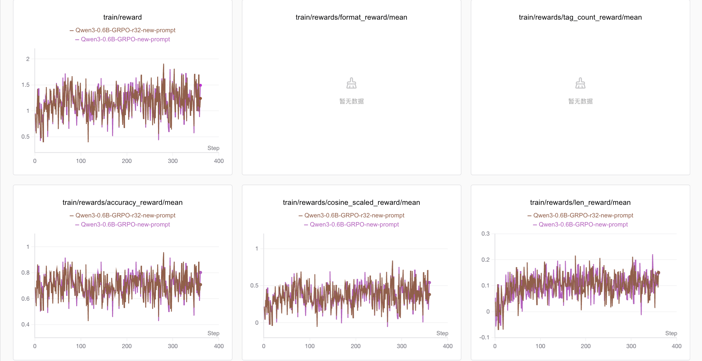

# GRPO 报告

## 基本信息
- **模型**：Qwen3-0.6B(Instruct)
- **训练框架**：Huggingface + Trl + Accelerate
- **数据集**：原`train.json`前 10000 条数据
- **主要目标**：通过GRPO奖励机制引导模型生成带 `<think>` 和 `<answer>` 标签的规范答案。

## 主要实验参数
- **LoRA rank**：8/16/32
- **Batch size**：24/28
- **num_generations**：6/7
- **学习率**：5e-5
- **奖励函数**：format_reward, tag_count_reward, accuracy_reward, cosine_scaled_reward, length_reward, repetition_penalty_reward（部分实验）
- **系统提示**：
  - "You are a helpful Math assistant. Carefully think step by step and enclose your response within <think> </think> and <answer> </answer> tags, respectively."

## 主要实验与结果
| 实验名称                | LoRA rank | batch_size | num_gen | 奖励函数                                   | val_300.json准确率 |
|------------------------|-----------|------------|---------|-------------------------------------------|-------------------|
| Baseline               | N/A       | N/A        | N/A     | N/A                                       | 74.33%            |
| Raw_r32_ng7            | 32        | 28         | 7       | format, tag, accuracy, cosine              | 72.67%            |
| Raw_r32_ng6_bs24       | 32        | 24         | 6       | format, tag, accuracy, cosine              | 71.67%            |
| Raw_r32_Len_Reward     | 32        | 24         | 6       | format, tag, accuracy, cosine, length      | 75.67%            |
| Raw_r16_Len_Reward     | 16        | 24         | 6       | format, tag, accuracy, cosine, length      | 72.33%            |
| Raw_r16                | 16        | 24         | 6       | format, tag, accuracy, cosine              | 71.00%            |
| Raw_r8                 | 8         | 24         | 6       | format, tag, accuracy, cosine, length      | 71.67%            |
| Raw_r16_cosine_modified| 8         | 24         | 6       | format, tag, accuracy, cosine, length      | 70.00%            |
| Raw_r32_repetition_penalty| 32     | 24         | 6       | format, tag, accuracy, cosine, length, repetition | 65.33%            |

## 主要图表
- 
- 
- 

## 主要结论
- GRPO总体的效果并不好，答题准确率相对baseline几乎都有所下降
- 主要原因推测：
    - Deepseek使用GRPO微调主要是为了模型按照特定格式输出答案(think和answer标签)，而Qwen3模型本身已经会推理(think标签)并输出答案(不带标签)，因此GRPO微调的必要性不大。
    - GRPO微调的奖励函数设计可能不够完善，目前的奖励函数主要是针对格式和标签的正确性，以及最终答案的正确性，但没有考虑到模型推理过程的完整性和逻辑性。