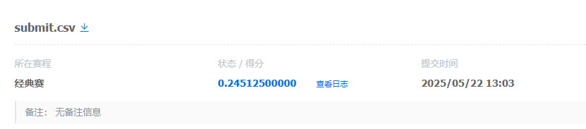

# 数据构建方案实现报告

## 方案概述及相对于baseline的改进

本报告记录了我们在数学问题求解项目中数据构建方案的实现。针对baseline可能存在的答案过于简单、缺乏解题步骤（思维链 COT）导致模型推理能力受限的问题，我们采用了以下数据构建方案来改进模型性能：

1. **答案步骤补充 (COT 生成)**：通过利用更高级的大模型(deepseek-r1-distill-qwen-32b)，为训练集中原有的简单答案补充详细的解题步骤，构建包含思维链的高质量训练数据。这直接增强了训练数据的信息量，有助于模型学习更复杂的推理过程，是相对于只使用简单答案基线的主要改进点。
2. **数据扩充**：基于现有数据，通过修改数字等方式生成新的问题和答案对，增加训练数据的多样性和数量。这是对baseline数据规模的补充。
3. **监督微调 (SFT)**：利用步骤 1 和 2 生成的、包含详细解题步骤的训练数据对基础模型进行监督微调。这使得模型能够学习生成带有 COT 的答案，从而提升其解决问题的能力，是方案的核心实现步骤。
4. **答案提取**：从模型生成的包含步骤的答案中精确提取最终的数字结果，用于评估和最终提交。这是为了确保即使模型生成了详细步骤，我们也能准确获取所需的最终答案格式。

## 实现进展

目前，我们已经实现了方案的 **监督微调 (SFT)** 应用部分和 **答案提取** 流程。具体体现在 `data_generation/test.py` 脚本中对经过 SFT 的模型进行批量推理和答案提取的过程。

* **SFT 模型应用**：在 `data_generation/test.py` 中，我们加载并使用了已经过 PEFT 微调的 Qwen2.5-0.5B-Instruct 模型。该模型是利用包含步骤的数据进行 SFT 的结果。
* **推理流程实现**：脚本负责加载测试数据 (`data/test.json`)，利用批量处理机制 (`BATCH_SIZE` 设置为 8) 对模型进行高效推理，生成包含解题步骤的答案。
* **答案提取逻辑**：实现了 `extract_final_answer` 函数，用于从模型生成的答案中提取最终的数字结果。该函数已经过调整以提高提取准确性。
* **结果保存**：将提取的答案保存到 `submit.csv` 文件。

## 测试结果与分析

我们使用配置为 BATCH_SIZE=8 和 max_new_tokens=1024 的 `data_generation/test.py` 脚本对全部 8000 条测试数据进行了批量推理。推理结果保存在 `submit.csv` 文件中。

根据提交结果显示，模型在测试集上的准确率为： **0.245125**。

