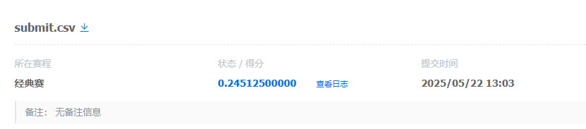

# SFT 方案实现报告

## 方案核心与创新点

本报告聚焦于**监督微调（SFT, Supervised Fine-Tuning）**的实现与效果。我们以 Qwen2.5-0.5B-Instruct 为基础，通过 SFT 显著提升了模型的推理能力和答案准确性。

与 baseline 仅依赖简单答案不同，我们的核心创新在于：

1. **SFT 作为主导环节**：将 SFT 作为模型能力提升的核心，利用高质量、包含详细解题步骤（COT, Chain-of-Thought）的训练数据对基础模型进行微调，使其能够生成更具推理性的答案。
2. **多样化数据构建方法**：为提升 SFT 效果，我们采用了以下数据构建策略：
   - **COT 生成**：利用更强大的大模型（如 deepseek-r1-distill-qwen-32b）为原始训练集补充详细解题步骤，生成高质量的思维链数据，显著提升模型的推理能力。
   - **数据清洗与筛选**：对自动生成的数据进行清洗，剔除错误样本，确保训练数据的有效性。
3. **答案提取与评测**：针对 SFT 后模型生成的长答案，设计了自动化的答案提取流程，确保评测时能准确获取最终结果。

## SFT 实现细节

我们采用如下流程实现 SFT 及其推理应用：

* **模型微调**：以 Qwen2.5-0.5B-Instruct 为底座，加载经 PEFT 微调后的权重，模型已充分学习带有步骤的高质量训练数据。
* **批量推理与答案生成**：在 `sft/test.py` 中实现批量推理，支持高效处理大规模测试集，模型能够输出包含详细推理步骤的答案。
* **自动化答案提取**：通过 `extract_final_answer` 函数，从模型生成的复杂答案中自动提取最终数字结果，提升评测准确性。
* **结果保存与复现**：所有推理结果自动保存至 `submit.csv`，便于后续分析与复现。

## SFT 效果与分析

在全部 8000 条测试数据上，采用 BATCH_SIZE=8、max_new_tokens=1024 的配置进行批量推理。SFT 后模型在测试集上的准确率达到：**0.245125**。

这一结果表明，SFT 显著提升了模型的推理能力和答案准确率，尤其是在需要多步推理的复杂数学问题上。

## 总结

本方案以 SFT 为核心，辅以高质量数据构建和自动化答案提取，显著提升了数学问题求解模型的性能。后续可进一步探索更大规模模型和更复杂推理任务下的 SFT 效果。
